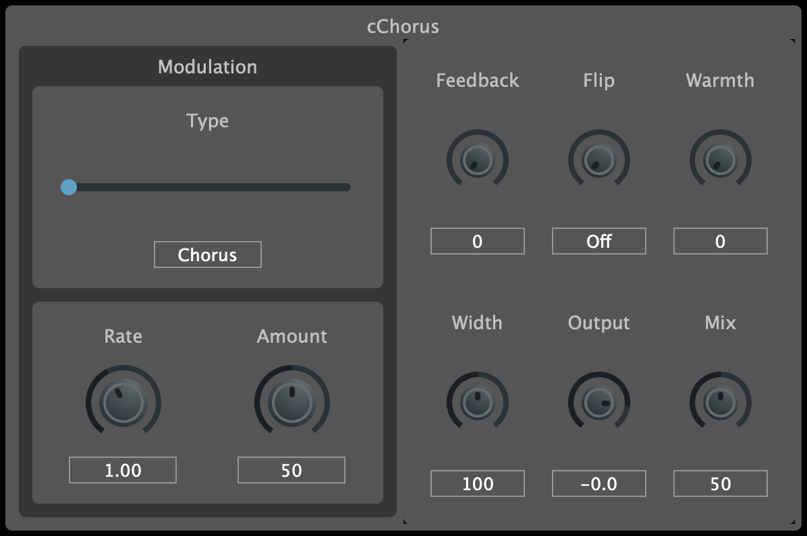

# cChorus

<p align="center"></p>

## Overview

cChorus is a simple chorus audio effect plugin available in VST3, AU, and CLAP formats for Mac and Windows, built using C++ and JUCE.

You can find the actual DSP code for this effect in the [cgo_modules](https://github.com/calgoheen/cgo_modules/tree/main/cgo_processors/effects) repository.

This project is inspired by the chorus audio effect found in a popular DAW.

## Build Instructions

### Prerequisites

- [CMake](https://cmake.org/)
- [Ninja](https://ninja-build.org/)

### Build

```
# Clone the repo
git clone --recurse-submodules https://github.com/calgoheen/cChorus.git
cd cChorus

# Configure and build
cmake --preset release
cmake --build --preset release
```

## Analysis

To recreate the sound of the chorus effect this plugin is modelled after, some analysis was performed in Python. The script is located in the `Analysis` folder, along with images of the generated plots.

An impulse train was used as input with a frequency of 32 Hz. This was passed through the chorus, producing an output that contains the delay taps at various points along the modulation curve.
The delay times were then plotted for each impulse to show the modulation curve, which was used to determine the settings for cChorus.

## External Dependencies

- [JUCE](https://github.com/juce-framework/JUCE)
- UI is built with [foleys_gui_magic](https://github.com/ffAudio/foleys_gui_magic)
- DSP modules from [chowdsp_utils](https://github.com/Chowdhury-DSP/chowdsp_utils)
- CLAP plugin format is built with [clap-juce-extensions](https://github.com/free-audio/clap-juce-extensions)
